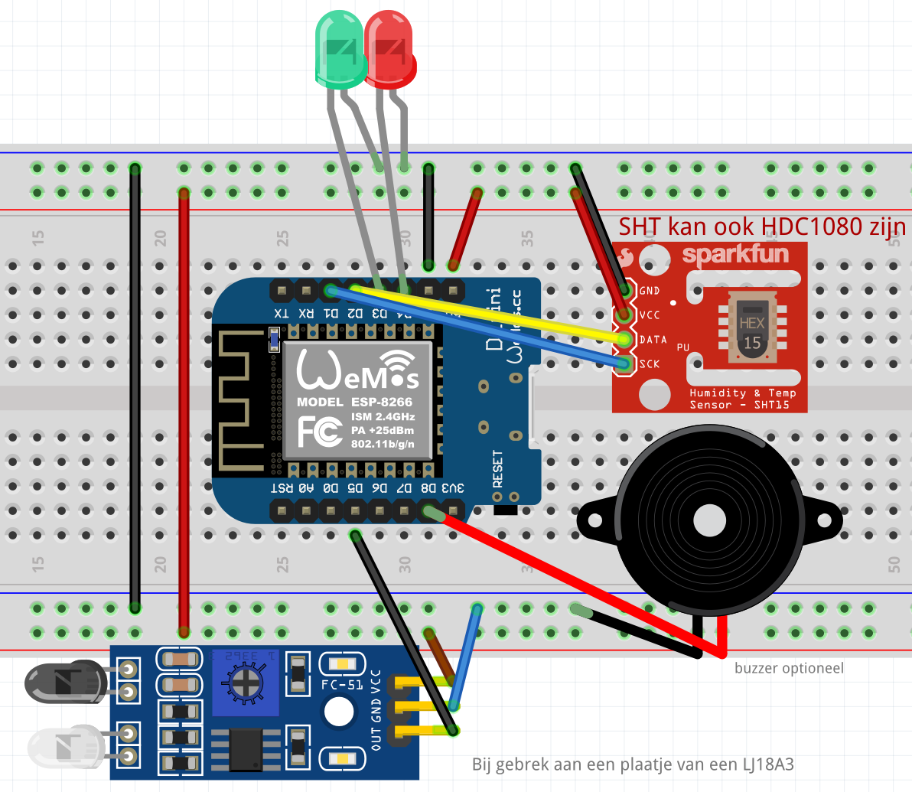

# watermeterkit

> Maak je even een backup van je Wemos? :)
> https://github.com/espressif/esptool
`.\esptool.exe --port COM13 --baud 115200 read_flash 0x000 4194304 backup-watermeter-model-b-1.2.bin`

De watermeterkit kun je kopen via watermeterkit.nl. Deze is compleet met behuizing. Maar helaas is er ook een nadeel. De YAML is niet vrijgegeven, dus hij is defacto closed source. Maar daar kunnen we iets aan doen :)

## Ja en nu?
1. De YAML voor model A en model B vind je [hier](esphome)
2. Wil je een generieke [behuizing](mount)
3. Of gewoon de [home assistant config?](homeassistant)

## Reverse enginering Model B
- NPN Proximity Sensor LJ18A3-8-Z/BX-5V (https://nl.aliexpress.com/item/32844213899.html)
  - 5v Bruin
  - gnd blauw
  - data zwart (D5)
- WemosD1 (https://nl.aliexpress.com/item/32651747570.html)
- RGB Led 
  - Vervang indien zelfbouw door Neopixel (https://nl.aliexpress.com/item/32732638750.html)
- HDC1080 (temperature humidity) Component in ESPhome
  - Model A heeft een SHT, advies: BME 280
- Additioneel
  - Buzzer (Restant van Tagreader (https://github.com/adonno/tagreader) D7?

|   |   | Wemos  |   |   |
|---|---|---|---|---|
|   |RST|   |TX |   |
|   |A0|   |RX |   |
|   |D0|   |D1 |HDC1080 - SCL|
|Pulsemeter|D5|   |D2 |HDC1080 - SDA|
|   |D6|   |D3 |Led G|
|   |D7|   |D4 |Led R|
|   |D8|   |GND|   |
|   |3v3|   |5V|   |

## Mounts
- Sensus 620 https://www.thingiverse.com/thing:4489072
- Generiek (In deze Repo)
- Kopen bij watermeterkit.nl
 
## Meuk
- https://www.jbswebcom.nl/knutselen/index.php/watermeter-uitlezen-met-npn-sensor
- https://community.home-assistant.io/t/inductive-npn-sensor-and-raspberry-pi/132487
- https://community.home-assistant.io/t/inductive-water-meter/144990/15
- https://esphome.io/components/sensor/pulse_counter.html
- https://gathering.tweakers.net/forum/list_messages/1596066/16
- https://www.huizebruin.nl/home-assistant/esphome/watermeter-uitlezen-in-home-assistant-met-esphome/
- https://github.com/frenck/home-assistant-config
